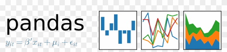

## Hi there 👋

## Projects 📂
### ⚡ *Mini Projects*

-  Todo List with **Flask** [🔰](https://github.com/Har8899/Todo-app-with-Flask)
  -------------------------------------------------------
  ## Skills

Languages:

           

Python Libraries:

   
  
IDEs I Have Worked on: 

     

  

- 🌱 I’m currently learning **Machine Learning**
- ✨ I'm starting a **15 day challenge** For myself where I will revise everything I've learned so Far

- 01/08/24 - Thu
    - Quatitative Aptitude
        - Aptitude Basics
        - Number System
        - LCM & HCF Theory
    - Logical Reasoning
        - Series
    - Verbal reasoning
        - Grammer
    - Python Basic
- 02/08/24 - Fri
    - Quatitative Aptitude
        - Remainder Theory
        - Surds and Indices Theory
    - Logical Reasoning
        - Series
    - Verbal reasoning
        - Grammer
    - Python Intermediate
        - Advance in Numbers
- 03/08/24 - Sat
    - Quatitative Aptitude
        - Percentage Theory
        - Average Theory
        - Ratio and Proportions Theory
    - Logical Reasoning
        - Series
    - Verbal reasoning
        - Comprehension
    - Python Intermediate
        - Advance in Numbers
        - Arrays
- 04/08/24 - Sun
    - Quatitative Aptitude
        - Aligations and Mixtures Theory
        - Profit and Loss Theory
        - Simple and Compound interest Theory
    - Logical Reasoning
        - Statements
    - Verbal reasoning
        - Comprehension
    - Python Data Structures
        - Time and Complexity
- 05/08/24 - Mon
    - Quatitative Aptitude
    - Logical Reasoning
        - Statements
    - Verbal reasoning
        - Sentence Completion
    - Python DSA
        - Time and Complexity
        - Recursion
- 06/08/24 - Tue
    - Quatitative Aptitude
        - Speed time and Distance theory
        - Boats And Streams Theory
    - Logical Reasoning
        - Classical reasoning
    - Verbal reasoning
        - Sentence Completion
    - Python DSA
        - Searching and Sorting
- 07/08/24 - Wed
    - Quatitative Aptitude
        - Time and Work Theory
        - Pipes and Cisterns Theory
        - Permutations and Combinations Theory
    - Logical Reasoning
        - Classical reasoning
    - Verbal reasoning
        - Narration
    - Python DSA
        - Searching and Sorting
- 08/08/24 - Thu
    - Quatitative Aptitude
        - Permutations and Combinations Theory
        - Probability Theory
    - Logical Reasoning
        - Classical reasoning
    - Verbal reasoning
        - Narration
    - Python DSA
        - Searching and Sorting
        - Stacks
- 09/08/24 - Fri
    - Quatitative Aptitude
      - Elementary Statistics
      - Geometry
      - Algebra
    - Logical Reasoning
        - Classical reasoning
    - Verbal reasoning
        - Narration
    - Python DSA
        - Stacks
        - Queues
- 10/08/24 - Sat
    - Quatitative Aptitude
        - Algebra
        - Miscellaneous
    - Logical Reasoning
        - Classical reasoning
    - Verbal reasoning
        - Narration
    - Python DSA
        - Linked Lists
        - Trees
- 11/08/24 - Mon
    - Quatitative Aptitude
    - Logical Reasoning
        - Analytical Reasoning
    - Verbal reasoning
        - Vocabulary
    - Python DSA
        - Binary search Tree
        - Hashing
- 12/08/24 - Mon
    - Quatitative Aptitude
    - Logical Reasoning
        - Analytical reasoning
    - Verbal reasoning
        - Extra
    - Python DSA
        - Hashing
- 13/08/24 - Mon
    - Quatitative Aptitude
    - Logical Reasoning
        - Statements
    - Verbal reasoning
        - Extra
    - Python DSA
        - Graphs
     
      
python basic = 5hrs
Quantitative Apt = 32hrs
Logical res = 15hrs
verbal res = 32hrs
