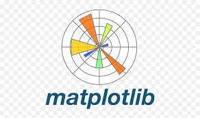
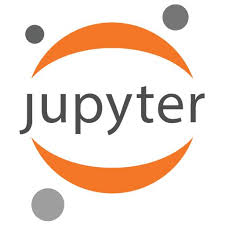
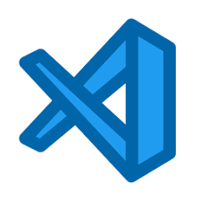

## Hi there 👋

## Projects 📂
### ⚡ *Mini Projects*

-  Todo List with **Flask** [🔰](https://github.com/Har8899/Todo-app-with-Flask)
  -------------------------------------------------------
  ## Skills

Languages:

           

Python Libraries:

   
  
IDEs I Have Worked on: 

     

  

- 🌱 I’m currently learning **Machine Learning**
- ✨ I'm starting a **15 day challenge** For myself where I will revise everything I've learned so Far
- ✔  Day 1 | Completed *Html* Revision.[ Link ](https://github.com/Har8899/Html)
- ✔ Day 2 | Completed *Python* [Numbers🔢](https://github.com/Har8899/Python).
  ## Complete **Machine Learning**
-  *Supervised Learning*
    - 📈 Day 3 | Regression Models
    - 📉 Day 4 | Classification Models
-  *Unsupervised Learning*
    - 🚦 Day 5 | Clustering Models
    - 👨‍🏫 Day 6 | Association Models
- *Reinforcement Learning*
    - Eclat
    - Apriori

- Day 7 | ✅ Data Analysis Project 1 👉 [Link](https://github.com/Har8899/Students-Scores)
- Day 8 | Machine Learning Project 1
- Day 9 | Learning Deep Learning
- Day 10 | learning Deep Learning 
- Day 11 | Learn NLP 
- Day 12 | Learning NLP
- Day 13 | Start Mini Project with NLP
- Day 14 | SQL
- Day 15 | Power BI
