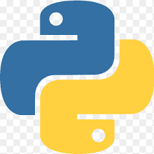
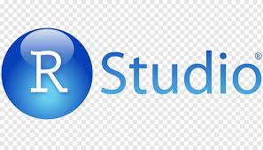
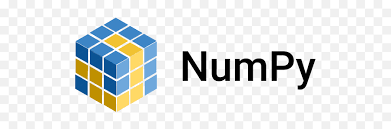

## Hi there 👋

## About Me
I am currently pursuing a career in Data science, having completed a diploma specializing in the field in 2023. Over the past year, I have focused on solidifying my knowledge and honing my skills in key areas such as *Python*, *Machine learning*, *Deep learning*, *Natural Language Processing*, *HTML*, *CSS*, and *JavaScript*. These skills have equipped me to tackle complex data challenges and contribute effectively to data-driven projects. I hold a Bachelor of Commerce (B.Com.) degree, which I earned in 2021.

## Projects 📂
### ⚡ *Mini Projects*

-  Todo List with **Flask** [🔰](https://github.com/Har8899/Todo-app-with-Flask)
  
  ## Skills

Languages:

           

Python Libraries:

   
  
IDEs I Have Worked on: 

     

  

